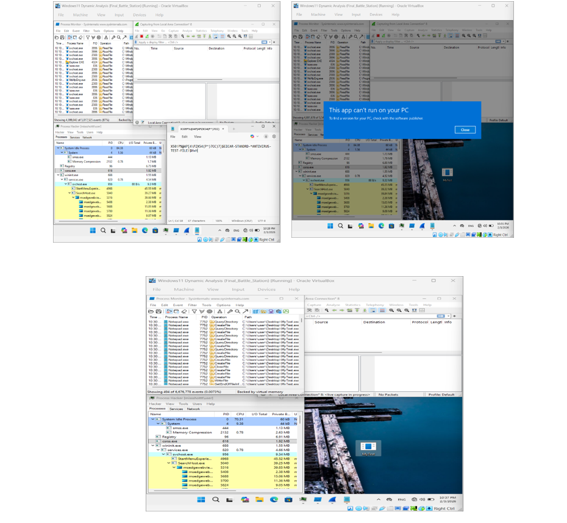
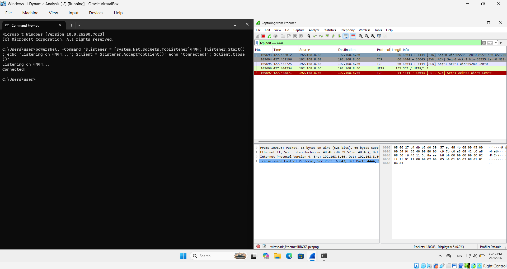

# Aisha's SOC Home Lab Implementation

## Project Overview
I built this SOC Home Lab from scratch to safely experiment with cyber attacks and analyze system behavior behind the scenes. The environment is completely isolated from my personal network to ensure a risk-free testing sandbox.

## Tools Used
* **Virtualization:** Oracle VirtualBox (Windows 11 Enterprise VM).
* **Network Analysis:** Wireshark.
* **System Monitoring:** Process Monitor (ProcMon) & Process Hacker.
* **Automation:** PowerShell.

## Key Scenarios

### 1. Malware Analysis (EICAR)
Performed static and dynamic analysis on the EICAR test file while monitoring system calls via ProcMon. I observed how the system responds to known signatures and tracked the process activity in real-time.

### 2. Network Attack Simulation
Simulated an unauthorized TCP connection on Port 4444. Analyzed the **TCP Three-Way Handshake** (SYN, SYN-ACK, ACK) using Wireshark to confirm the connection status and monitor how the traffic is logged.

## Conclusion
This project successfully demonstrated the implementation of a controlled SOC Analyst Lab for malware analysis and network forensics. By establishing a strictly isolated environment, I was able to safely execute suspicious files and simulate unauthorized network connections without risking the host system's integrity.
* [📄 Download Full SOC Analysis Report (Word)](Report.docx)
